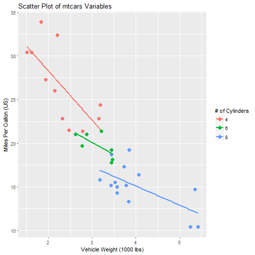

wk4_presentation
========================================================
author: x46182
date: October 1, 2017
autosize: true

mtcars Shiny Application
========================================================

- The Shiny Application hosted is hosted at https://x46182.shinyapps.io/ddp_wk4_assign/
- This application allows the user to graph two numeric variables against each other in a scatter plot
- The factor variables are used as a coloring aesthetic.  The factor variables in this particular Shiny Application are:

                - cyl (# of Cylinders)
                - vs (V/S)
                - am (Automatic/ Manual Transmission)
                - gear (# of forward gears that the vehicle has)
                - carb (# of carburetors that the vehicle has)
                
- For more information on the **mtcars** dataset, google **mtcars [R]**

mtcars head()
===

The first six rows of the data used in the application are as follows: 


```
                   mpg cyl disp  hp drat    wt  qsec vs am gear carb
Mazda RX4         21.0   6  160 110 3.90 2.620 16.46  0  1    4    4
Mazda RX4 Wag     21.0   6  160 110 3.90 2.875 17.02  0  1    4    4
Datsun 710        22.8   4  108  93 3.85 2.320 18.61  1  1    4    1
Hornet 4 Drive    21.4   6  258 110 3.08 3.215 19.44  1  0    3    1
Hornet Sportabout 18.7   8  360 175 3.15 3.440 17.02  0  0    3    2
Valiant           18.1   6  225 105 2.76 3.460 20.22  1  0    3    1
```

Example Plot in Shiny Application
========================================================



***

- The graph at the right is a sample plot from the Shiny Application in the case when the user selects 'wt' for the x-axis, 'mpg' for the y-axis, and 'cyl' for the color.
- The three seperate lines show te different linear models applied to the cars with 4 (red line), 6 (green line), and 8 (blue line) cylinders.  
- The user can see the relationship between 'wt' and 'mpg' (the lower the weight, the higher the miles per gallon) while also seeing the difference between the car with a varying number of cylinders. 

Questions?
===
